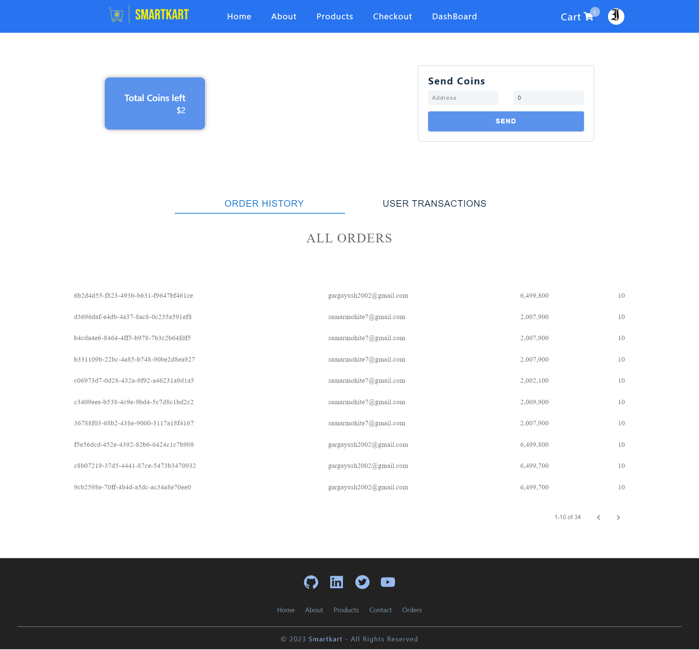

<p align='center'>

</p>
<p align='center'>
<b>
Empowering Shopping Through Web3: Experience SmartKart's Revolutionary Token-Powered E-Commerce.
</b>

</p>
<p align='center'>
<a href='https://tomper-wear.netlify.app/' target='_blank'>tomper-wear.netlify.app</a>
</p>

---

<p align='center'>
This is the frontend of TomperWear build with MERN stack and deployed with <a href='https://www.netlify.com/' target='_blank'>Netlify</a>
</p>

<p align='center'>

</p>

## 🚀 Link to [Admin panel](https://github.com/varunKT001/tomper-wear-ecommerce-admin), [Backend](https://github.com/varunKT001/tomper-wear-ecommerce-backend)

## 📷 Link to [Screenshots](./SCREENSHOTS.md)

## 🎥 Link to [Video demo](https://youtu.be/5oGqxtSN0jY)

## 🧾 Description

In the dynamic landscape of online shopping, a revolutionary transformation is underway with the emergence of SmartKart—an avant-garde e-commerce platform that leverages the cutting-edge capabilities of Web3 technology. SmartKart isn't just another online marketplace; it's a paradigm shift that combines the convenience of digital retail with the decentralized power of blockchain.

At the core of SmartKart's ethos lies its pioneering tokenomics framework, which redefines customer engagement and loyalty. By integrating its proprietary token system, SmartKart rewards its dedicated patrons with tokens that extend beyond traditional perks, transcending into a realm of decentralized incentives. These tokens don't just represent transactional value; they signify a community-driven ecosystem where customers become stakeholders, sharing in the success and growth of the platform.

SmartKart's commitment to transparency, security, and authenticity is underpinned by Web3 technology, ensuring every interaction is verifiable and tamper-proof on the blockchain. Through this innovative architecture, users can explore an extensive array of products from trusted vendors while enjoying unparalleled data privacy and control.

Join us as we embark on a journey to reshape the future of online shopping. With SmartKart, the convergence of Web3 prowess and customer-centric tokenomics marks a new era in e-commerce—one where empowerment, innovation, and inclusivity thrive. Welcome to the dawn of a smarter shopping experience; welcome to SmartKart.

## ✨ Features

#### Client

Users shopping through this platform enjoys following features:

- [x] User authentication using google firebase.
- [x] Users can change their username and display image.
- [x] Users can filter products on various parameters.
- [x] Users can sort products according to price and name.
- [x] Users can add products to cart.
- [x] Users can order products by providing their shipping information and card details for payments.
- [x] Users can view their order's status and their previous orders.
- [x] Users can review the products (or update their previous reviews) and benefit other customers.
- [x] Users can send feedbacks to the owner.
- [x] Responsive for all screen sizes.

Following are some of the unique features and technologies implemented in Smartkart utilizing blockchain technology and an innovative token economics:

- [x] <b>Decentralized Shopping Experience</b>: SmartKart utilizes Web3 technology to ensure secure, transparent, and tamper-proof transactions on the blockchain, guaranteeing a trusted shopping environment.
- [x] <b>Token Reward System:</b> Our platform introduces a novel tokenomics framework, rewarding loyal customers with exclusive tokens for their purchases. These tokens grant customers a stake in the platform's growth and success.
- [x] <b>Customer Incentivization:</b> Users are incentivized to leave genuine product reviews through token rewards. Our proprietary algorithm evaluates the authenticity of reviews, fostering a community-driven, honest feedback loop.
- [x] <b>Verified Vendor Network:</b> SmartKart partners with trusted vendors, verified on the blockchain, ensuring that customers have access to high-quality products from reputable sources.
- [x] <b>Data Privacy and Control:</b> Our decentralized architecture grants users greater control over their personal data, ensuring data privacy is upheld without compromising the shopping experience.
- [x] <b>Token Utility:</b> SmartKart tokens go beyond transactional value; they can be used to unlock discounts, access exclusive promotions, and participate in platform governance decisions.
- [x] <b>Community Engagement:</b> The token-powered ecosystem encourages active user participation, building a vibrant community of shoppers, vendors, and stakeholders.
- [x] <b>Token Wallet:</b> Every user gets a secure digital wallet to store and manage their earned tokens, enabling easy tracking and redemption of rewards.

We are also proposing an exclusive feature of <b>Review Incentivization</b> that is implemented for the first time in Smartkart:

- [ ] <b> Authenticity Algorithm:</b> SmartKart employs a sophisticated algorithm that evaluates the genuineness of product reviews. Users are rewarded with tokens for leaving honest feedback, driving meaningful interactions.
- [ ] <b>Trustworthy Feedback:</b> With the blockchain verifying review authenticity, customers can rely on accurate feedback, making informed purchasing decisions.

#### Dashboards

Smartkart provides it's users an easy to use dashboard interface.

**1. Seller Dashboard**
This is the dashboard which is available for the aid of sellers. Sellers can keep a track of teir dispatcked orders and transactions made with customers.

<p align='center'>

</p>

**2. Customer Dashboard**

This dashboard functionality is available to help the customers maintain their order history and also to keep track of the tokens that they have received from different brands.

<p align='center'>

</p>

## ⚙ Tools and Technologies used

#### [Client](https://github.com/varunKT001/tomper-wear-ecommerce)

1. [React.js](https://reactjs.org/)
2. [React-icons](https://react-icons.github.io/react-icons/)
3. [Styled-Components](https://styled-components.com/)
4. [Firebase](https://firebase.google.com/)
5. [Formspree](https://formspree.io/)
6. [Material-ui](https://mui.com/material-ui/)
7. [Supabase-SDK](https://supabase.com/)

#### [Blockchain](https://github.com/varunKT001/tomper-wear-ecommerce-backend)

1. [Hardhat](https://hardhat.org/)
2. [Ethers](https://docs.ethers.org/v5/)

## 🛠 Installation and setup

1. Clone the repo to your local machine.
2. Install the required dependency for server using :

   ```javascript
   npm install
   ```

3. Create a `.env` file and copy-paste the contents of `.env.sample` in it.

4. Start the dev server using :

   ```javascript
   npm start
   ```

## 🏎 Creating production built

1. Create a production ready react app using the command :

   ```javascript
   npm run build
   ```

## 😎 Team Members

<table>
  <tr>
    <td align="center">
      
      <br/>
      Ishaan Sharma
      <br/>
      2020IMT-040
      <br/>
      <a href="https://www.linkedin.com/in/ishaan-sharma-195770202/">LinkedIn</a>
      <a href="https://github.com/sharmaishaan21">Github</a>
    </td>
  </tr>
</table>
